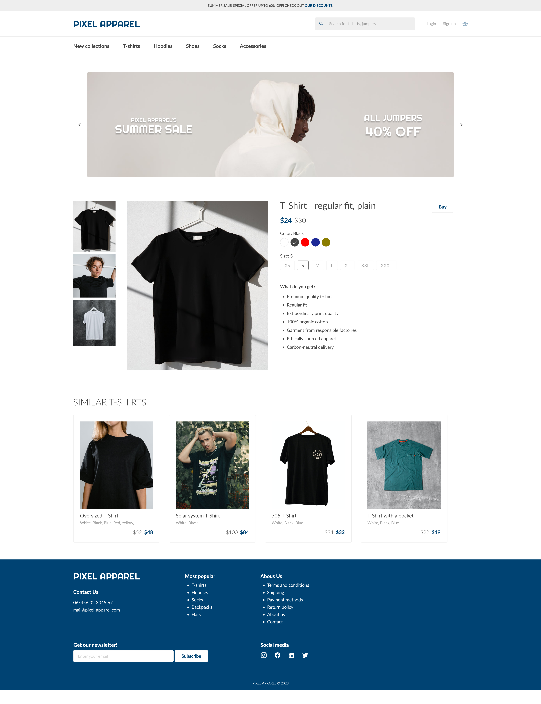
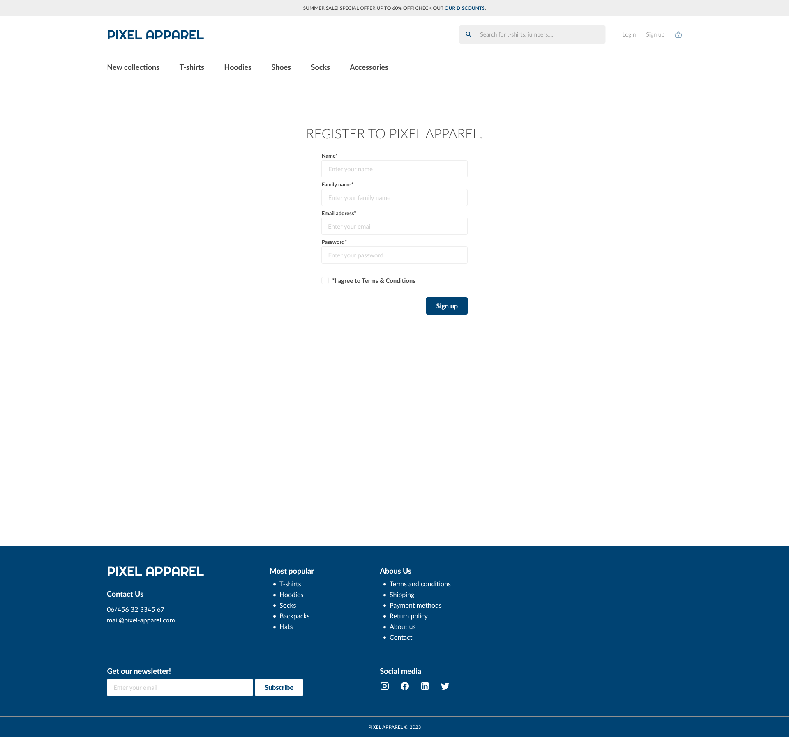
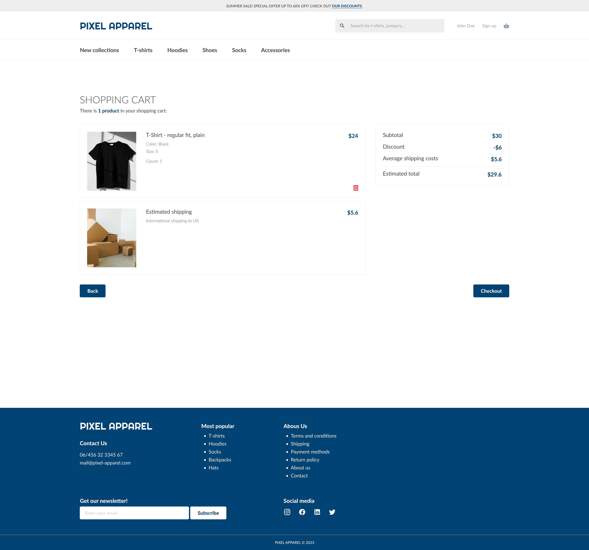
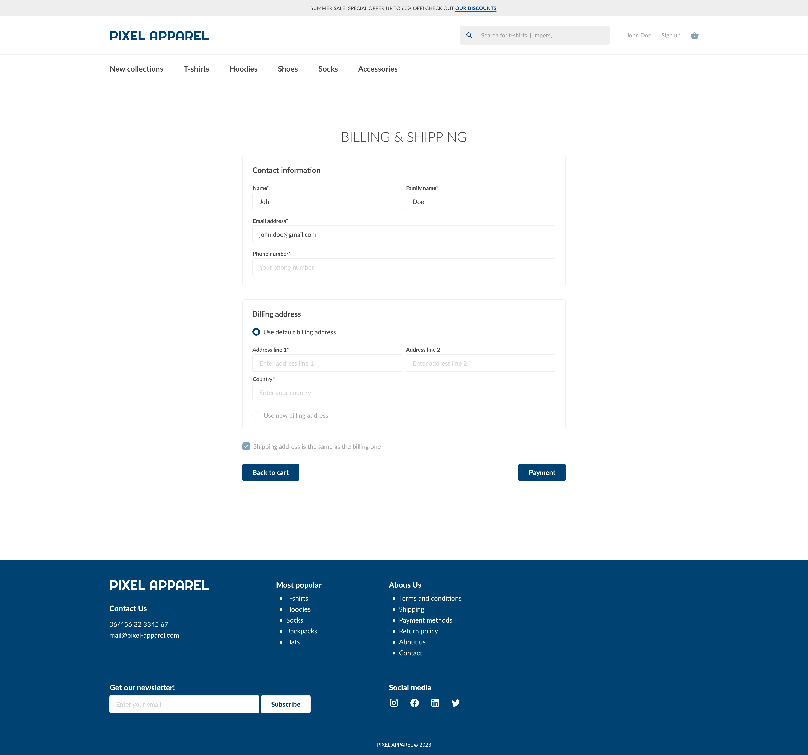
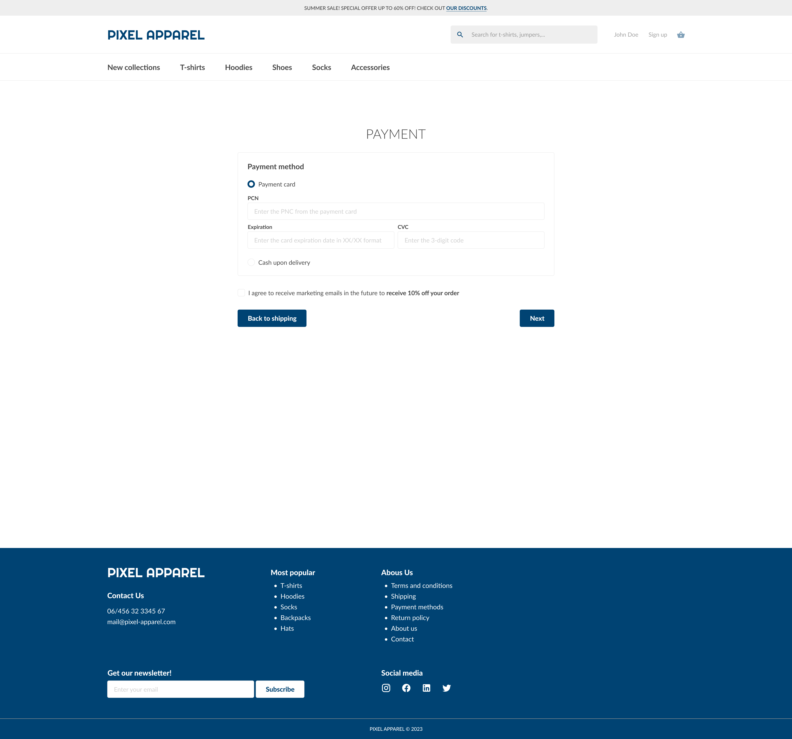
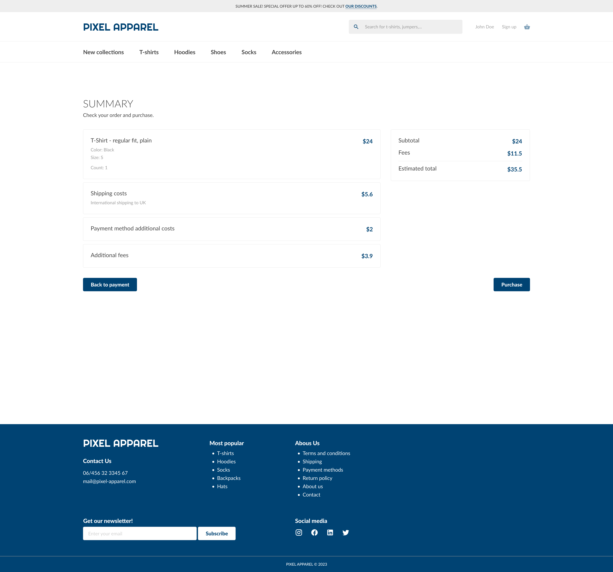
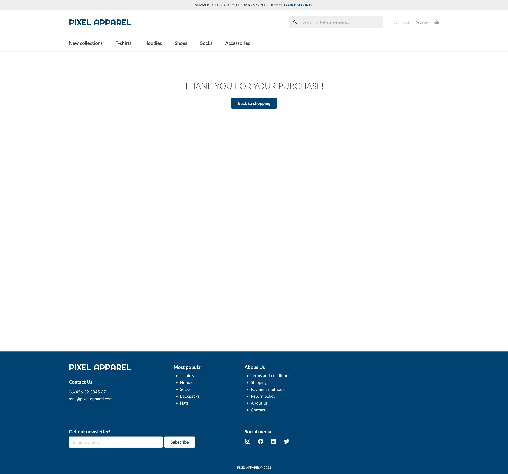

# Unmoderated usability studies evolved: Can GPT ask useful follow-up questions?

## About

This is the official repository for the research paper [*"Unmoderated usability studies evolved: Can GPT ask useful follow-up questions?"*](https://www.tandfonline.com/doi/full/10.1080/10447318.2024.2427978). The work is dedicated to the use of follow-up questions in usability testing generated by GPT-4.

ChatGPT (and by extension, its successor GPT-4) have taken the world by storm with the potential applications of artificial intelligence. In the field of usability research, one such application of GPT-4 are follow-up questions asked by an AI chatbot. Traditionally, asking follow-up questions to conversationally extract further information from participants is the prerogative of a human moderator in moderated studies. This case study investigates whether GPT-4 can competently ask follow-up questions to obtain valuable information from participants, such as to identify more usability issues.

An experiment is conducted with 60 participants. The results are compared between groups who are and are not asked follow-up questions generated by GPT-4.  Properties of obtained answers are explored, problems with generated questions are presented and strategies for generating better follow-up questions are discussed.


### Table of contents

* [Paper citation](#paper-citation)
* [Dataset](#dataset)
* [Scripts](#scripts)
* [Prototype](#prototype)
* [Authors](#authors)
* [License](#license)


## Paper citation

```bibtex
@article{doi:10.1080/10447318.2024.2427978,
  title = {Unmoderated Usability Studies Evolved: Can GPT Ask Useful Follow-up Questions?},
  journal = {International Journal of Human–Computer Interaction},
  year = {2024},
  publisher = {Taylor & Francis},
  doi = {https://doi.org/10.1080/10447318.2024.2427978},
  url = {https://www.tandfonline.com/doi/full/10.1080/10447318.2024.2427978},
  author = {Eduard Kuric and Peter Demcak and Matus Krajcovic}
}
```

## Dataset

In our study, we have data from 60 participants during the two usability test experiment variants (30 participants each):
- [Raw data](./analysis/data/results-raw.csv) from participant's answers
- [Tagged data](./analysis/data/results-notes.csv) by assigning data tags by UX researcher

These data were further processed into the final [result file](./analysis/data/results.csv) (see [Data preparation](#data-preparation)). This file contains:
- initial questionnaire answers (demographics)
- open-text question with follow-ups answers 
  - columns are in format `[T|pre|post]<task-order-number>[Q<question-number>]?[F<follow-up-number>]?[Q|Note|WordCount|Sentiment]?`
  - for example, T1Q1F2, T2Q3F1Q or pre1Q2Note
- final questionnaire answers (question reasonability)

In notes, tags are present, more info on which are present in the article:
- Informativeness tags: `info-high`, `info-med`, `info-low`, `info-none`
- Sentiment tags: `s-neg`, `s-neu`, `s-pos`
- Repeat tags: `repeat-cross`, `repeat-followup`
- Non-answer tags: `question-none`, `question-skip`, `content-unrelated`

Usability and task issues:

| Issue ID | Brief description |
|---|---|
| Usability issues: |  |
| `i-bad-website-overall` | Website was described as overall bad or unfriendly. |
| `i-black-filter-wrong-color` | The color of the black filter was dark gray, not black. |
| `i-buy-button-wrong-label` | The Add to cart button has a “Buy” label which doesn’t correspond with its action. |
| `i-cart-notification-missing` | Missing notification after adding the item into the shopping cart. |
| `i-default-white-tshirt` | By default, when opening the black t-shirt from the productlist, white option is selected. |
| `i-intrusive-popups-overall` | Pop ups were described as overall intrusive. |
| `i-missing-checkout-link-in-popup` | No link to checkout in the free shipping popup, only close and continue shopping buttons are present. |
| `i-missing-payment-methods` | Only credit card and cash payment methods are available. |
| `i-missing-sign-up-link-in-popup` | Missing link to the sign up page in the “You need an account” pop up. |
| `i-no-shipping-on-product-page` | Missing shipping information on the t-shirt page. |
| `i-search-problems `| Unclickable t-shirt in the search bar or other problems related to the search bar. |
| `i-small-unreadable-elements` | Some elements (checkboxes, inputs) on the webpage are small and have low contrast. |
| `i-sort-not-found` | Sorting button at the top right was not found by the participant. |
| `i-unclickable-product-image` | Product image (t-shirt) in the product list is not clickable. |
| `i-unexpected-fees` | Unexpected additional fees and costs at the end of the checkout process. |
| `i-unexpected-pre-filled-fields` | Participants did not expect the fields to be pre-filled. |
| `i-unnoticed-left-out-fields` | Participants did not notice unfilled fields. |
| `i-unwanted-marketing-consent` | Marketing consent can’t be revoked. |
| `i-unwanted-sign-up` | Sign up was mandatory to put the t-shirt in the shopping cart. |
|  |  |
| Task issues: |  |
| `ti-complicated-scenario` | Task scenario was overall complicated. |
| `ti-repetetive-ai` | AI questions were repetitive and annoying. |
| `ti-scroll-problems` | Undefined prototype scrolling problems. |
| `ti-task-description-overlap` | Instruction window overlapped with the prototype. |
| `ti-unresponsive/unclickable` | Some parts of the prototype were unclickable. |

Other tags (answer topic - participants describes following topics):
- `t-act` - description of actions performed during the task.
- `t-imp` - views and feelings about current experience during the task
- `t-obs` - description of the user interface or experience as perceived
- `t-prop` - suggestions for improvement of the user experience
- `t-exp` - elaboration on the reasons behind the participant's behavior
- `t-know` - background information relevant to the task

Sentiment is calculated automatically via `nltk` python library as well as from the assigned tags. In the article, assigned tags are used. Word counts are also calculated (full-meaning words without stop-words).

## Scripts

All of the scripts are written using Python (version 3.11.3) and other external libraries installed using pip (version 22.3.1). Scripts were executed using jupyter notebooks. A [requirements file](./analysis/requirements.txt) is provided for installing dependencies. After installing Python, the below commands can be used in the [analysis](./analysis/) directory to install the environment and launch the notebooks:
```
python -m venv .venv
.venv\Scripts\activate
pip install -r requirements.txt
jupyter notebook
```

This will create your virtual environment, install the dependencies and launch the python notebooks with the analysis files. After the installation, to launch the notebooks again, use these commands:

```
.venv\Scripts\activate
jupyter notebook
```

### [Data preparation](./analysis/scripts/1_data_preparation.ipynb)
Cleaning or renaming the data, calculating variables such as word counts and merging the resulting data into one [result file](./analysis/data/results.csv).

### [Respondents](./analysis/scripts/2_1_respondent_stats.ipynb)

Descriptive analysis of the respondent's sample.

### [Overall results](./analysis/scripts/2_2_result_stats.ipynb)

Descriptive analysis of the results.

### [Question tag data analysis](./analysis/scripts/3_1_question_tags.ipynb)

Statistical analysis of assigned tags - informativeness, skips, repeats, sentiment and topics.

### [Question content data analysis](./analysis/scripts/3_2_question_auto.ipynb)

Statistical analysis of answer contents - word count.

### Helping functions and constants

Contains helping functions for statistical tests, working with data or visualizations:
- [Constants and help functions](./analysis/scripts/constants.py)
- [Statistical test help functions](./analysis/scripts/tests.py)
- [Visualizations](./analysis/scripts/charts.py)


## Prototype

A [preview of the prototype](https://study.uxtweak.com/prototype/preview/0FxBbwLQ3h6QqOQIXYhuy/fB58GCyvGGk2NqmB1e1Uf) without debriefing questions is available online.

Prototype screenshots:

<table>
<tr>
<td>Homepage</td>
<td>T-shirt category page</td>
<td>Product page</td>
</tr>
<tr>
<td>Register page</td>
<td>Cart</td>
<td>Billing/Shipping</td>
</tr>
<tr>
<td>Payment</td>
<td>Summary</td>
<td>Thank you page</td>
</tr>
</table>

## Authors

### General contact 

Email: 
**chatgpt.uxtweak.research@gmail.com**


**Eduard Kuric**\
He is a researcher and lecturer at [Faculty of Informatics and Information Technologies](https://www.fiit.stuba.sk/), [Slovak University of Technology in Bratislava](https://www.stuba.sk/). His research interests include human-computer interaction analysis, user modeling, personalized web-based systems, and machine learning. Eduard is also the head of the UX Research Department and the founder of [UXtweak](https://www.uxtweak.com/).
- [LinkedIn](https://www.linkedin.com/in/eduard-kuric-b7141280/)
- [Google Scholar](https://scholar.google.com/citations?user=MwjpNoAAAAAJ&hl=en&oi=ao)
- Email: eduard.kuric([AT])stuba.sk

**Peter Demcak**\
Researcher with background in software engineering, whose current topics of interest involve user behavior, human-computer interaction, UX research methods and design practices, and machine learning. Currently occupies the position of a scientific and user experience researcher at [UXtweak](https://www.uxtweak.com/), with focus on research that supports work of UX professionals.

- Email: peter.demcak([AT])uxtweak.com

**Matus Krajcovic**\
User experience researcher at [UXtweak](https://www.uxtweak.com/) and computer science student at [Faculty of Informatics and Information Technologies](https://www.fiit.stuba.sk/), [Slovak University of Technology in Bratislava](https://www.stuba.sk/). Currently focuses on data analysis and research in machine learning use in the field of human-computer interaction.
- [LinkedIn](https://linkedin.com/in/matus-krajcovic)
- Email: matus.krajcovic([AT])uxtweak.com


## License
This work is licensed under a [Creative Commons Attribution-NonCommercial 4.0 International License](http://creativecommons.org/licenses/by-nc/4.0/).

[](http://creativecommons.org/licenses/by-nc/4.0/)


